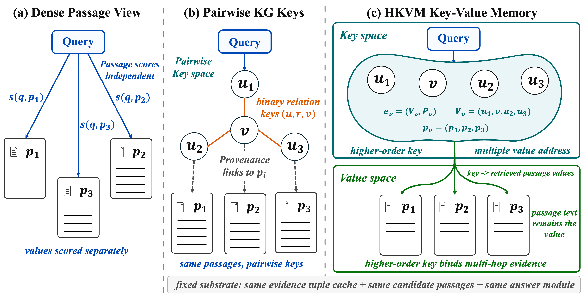
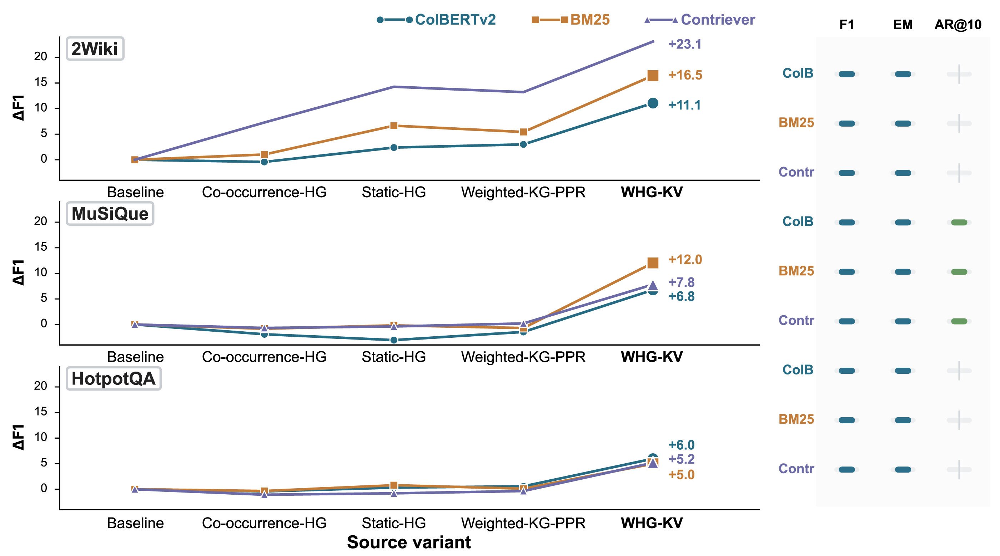
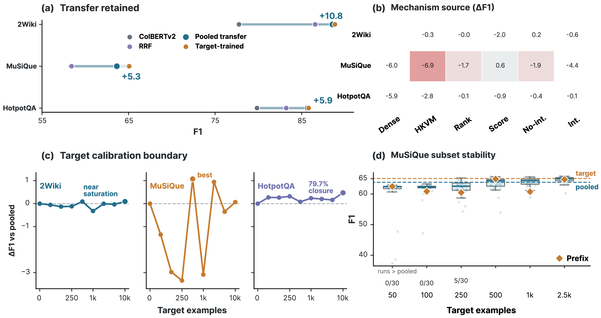
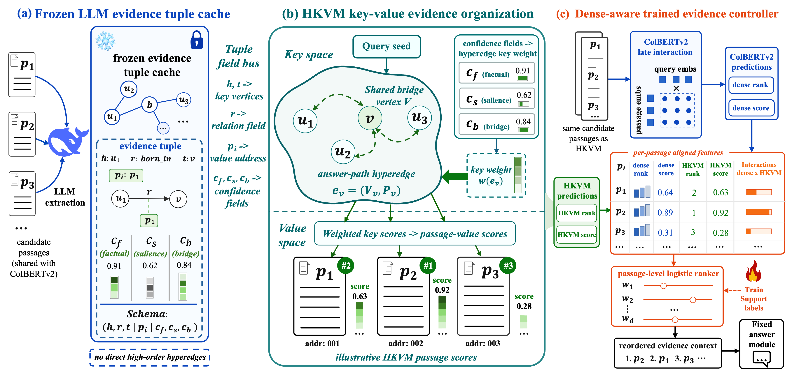

# HKVM-RAG: Key-Value-Separated Hypergraph Evidence Organization for Multi-Hop RAG

[](https://github.com/Mingyu-Zh/HKVM-RAG)
[](https://arxiv.org/abs/2606.07218)
[](LICENSE)
[](https://www.python.org/)
[](https://github.com/Mingyu-Zh/HKVM-RAG)

**Mingyu Zhang¹, Fanghui Sun¹, Chunjing Xiao², Ying Ma¹\***  
*¹Faculty of Computing, Harbin Institute of Technology, Harbin, China*  
*²School of Computer and Information Engineering, Henan University, Kaifeng, China*  
\*Corresponding author

---

## Abstract

Multi-hop RAG depends not only on finding relevant passages, but also on organizing them into evidence units that expose answer-supporting chains. We study this layer as a controlled data-engineering problem: under a fixed extraction substrate and matched retrieval budget, does changing the retrieval key space from pairwise graph keys to answer-path hypergraph keys improve passage organization? HKVM-RAG constructs answer-path hyperedges from cached LLM evidence tuples as retrieval keys while keeping passage text as values. As a standalone structured retriever, weighted hypergraph key-value retrieval improves over pairwise KG-PPR on 2WikiMultiHopQA (+3.426 F1) and MuSiQue (+3.592 F1), while HotpotQA marks the boundary where structure alone is insufficient. As an evidence-control signal, a lightweight controller over frozen ColBERTv2 and WHG-KV features reaches 88.846 F1 on 2WikiMultiHopQA (+11.084), 65.073 F1 on MuSiQue (+6.763), and 85.810 F1 on HotpotQA (+5.966). Source-level ablations show that matched non-WHG structured sources do not reproduce the gain, and the same pattern holds under BM25 and Contriever first-stage retrieval. Transfer and target-calibration audits further show that the dense/HKVM rank-score signal transfers across benchmarks under frozen prediction artifacts, while target-domain calibration and sample composition still matter. These results position key-value-separated hypergraph organization as a reusable evidence-control layer that complements, rather than replaces, lexical and dense retrievers.

---

## Conceptual Overview

<p align="center">
  
</p>

**Left:** Dense retrieval scores passages independently. **Center:** Pairwise KG retrieval uses binary entity-relation keys. **Right:** HKVM-RAG uses an answer-path hyperedge as one higher-order retrieval key that maps back to multiple passage values.

---

## Key Results

### Fixed-Substrate: WHG-KV vs KG-PPR

| Dataset | WHG-KV vs KG-PPR (ΔF1) | 95% CI |
|---------|:----------------------:|:------:|
| 2WikiMultiHopQA | **+3.426** | [+2.877, +3.984] |
| MuSiQue | **+3.592** | [+1.917, +5.155] |
| HotpotQA | −0.689 | [−1.453, +0.071] |

### Dense-Aware Controller

| Dataset | Controller F1 | Δ vs ColBERTv2 | Δ vs Learned HKVM |
|---------|:------------:|:--------------:|:-----------------:|
| 2WikiMultiHopQA | **88.846** | +11.084 | +0.455 |
| MuSiQue | **65.073** | +6.763 | +8.319 |
| HotpotQA | **85.810** | +5.966 | +2.881 |

### Source-Level: WHG-KV Is the Strongest Structured Complement

| First-stage | 2Wiki F1 | MuSiQue F1 | HotpotQA F1 |
|------------|:--------:|:----------:|:-----------:|
| ColBERTv2 + WHG-KV | 88.846 | 65.073 | 85.810 |
| BM25 + WHG-KV | 88.325 | 58.083 | **86.806** |
| Contriever + WHG-KV | 88.618 | 63.378 | 85.096 |

> WHG-KV improves F1 over the corresponding first-stage baseline by +4.971 to +23.119 across all nine dataset×first-stage rows. All nine paired-bootstrap F1 intervals are fully positive.

<p align="center">
  
</p>

*Source-effect diagnostics for dense-aware evidence control. Left: ΔF1 trajectory across structured sources (ColBERTv2, BM25, Contriever first-stage). Right: WHG-KV margin over best non-WHG complement for F1, EM, and AR@10.*

### Transfer over Frozen Prediction Artifacts

| Target | Pooled Transfer F1 | Target-Trained F1 | Δ vs ColBERTv2 |
|--------|:-----------------:|:-----------------:|:--------------:|
| 2WikiMultiHopQA | 88.555 | 88.846 | +10.793 |
| MuSiQue | 63.645 | 65.073 | +5.335 |
| HotpotQA | 85.706 | 85.810 | +5.862 |

> The dense/HKVM rank-score signal transfers across benchmarks, but target-domain calibration and sample composition still matter. See the [supplementary material](supplemental_material.pdf) for full bootstrap tables, held-out slice audit, hyperparameter sensitivity, enhanced KG baselines, and cost/resource disclosure.

<p align="center">
  
</p>

*Transfer and target-calibration boundary over frozen prediction artifacts. (a) Leave-one-target transfer. (b) Transfer feature ablation. (c) Target-domain calibration. (d) MuSiQue repeated random-subset audit.*

---

## Method

<p align="center">
  
</p>

**(a)** A frozen LLM evidence tuple cache stores passage-level relation triples with confidence fields. **(b)** HKVM assembles answer-path hyperedge keys, weights them with extractor confidence, diffuses query-seeded scores, and projects to passage-value scores. **(c)** The dense-aware controller aligns frozen ColBERTv2 and HKVM predictions by passage id and trains a logistic ranker to reorder the evidence context.

---

## Quick Verification

```bash
git clone https://github.com/Mingyu-Zh/HKVM-RAG.git
cd HKVM-RAG
# Download data/ and frozen_outputs/ from Hugging Face:
# https://huggingface.co/datasets/MingY-Zh/HKVM-RAG

python scripts/verify_paper_evidence.py
```

**Expected output:** `checks=63 bad=0`

Then verify file integrity:

```bash
shasum -a 256 -c manifests/FILES.sha256
```

---

## Fixed-Substrate Rerun

```bash
conda env create -f environment.yml
conda activate hkvm

python scripts/reproduce_fixed_substrate.py \
  --setting 2wiki \
  --methods bm25,kg_ppr,weighted_hg_kv \
  --runs 1 \
  --limit 20 \
  --output_dir runs/smoke_2wiki
```

Full reruns: `--setting 2wiki`, `musique`, or `hotpotqa`.

---

## Repository Structure

| Path | Purpose |
|---|---|
| `hkvm_mvp/` | Core HKVM-RAG implementation |
| `configs/` | Reviewer-facing configs named by paper concept |
| `scripts/reproduce_fixed_substrate.py` | Entry point for fixed-substrate reruns |
| `scripts/verify_paper_evidence.py` | Deterministic verification of paper-facing results |
| `scripts/build_release_manifest.py` | Generate SHA-256 file manifest |
| `docs/` | Release, attribution, and reproduction notes |
| `results/paper_evidence/` | Tables, bootstrap summaries, claim-evidence maps |
| `results/paper_evidence/heldout_slice_audit/` | Deterministic 30% held-out slice audit |
| `results/paper_evidence/cost_efficiency_audit/` | Cost, latency, and resource footprint audit |
| `results/paper_evidence/source_level_ablation/` | BM25/Contriever first-stage source diagnostics |
| `supplemental_material.pdf` | Supplementary material (8+ pages) |
| `manifests/FILES.sha256` | SHA-256 manifest for integrity verification |

---

## Hosting

| Platform | Contents |
|---|---|
| **GitHub** | Code, configs, scripts, docs, results, manifests, supplement |
| [**Hugging Face**](https://huggingface.co/datasets/MingY-Zh/HKVM-RAG) | `data/` (benchmarks + DeepSeek extraction caches), `frozen_outputs/` (frozen dev predictions + train-side predictions for transfer/calibration experiments) |

---

## Citation

If you use this code or data in your research, please cite the accompanying paper:

```bibtex
@misc{zhang2026hkvmrag,
  title        = {{HKVM-RAG}: Key-Value-Separated Hypergraph Evidence Organization for Multi-Hop {RAG}},
  author       = {Zhang, Mingyu and Sun, Fanghui and Xiao, Chunjing and Ma, Ying},
  year         = {2026},
  eprint       = {2606.07218},
  archivePrefix = {arXiv},
  primaryClass = {cs.IR},
  howpublished = {\url{https://arxiv.org/abs/2606.07218}},
}
```

---

## License

MIT License — see [LICENSE](LICENSE) for details.
